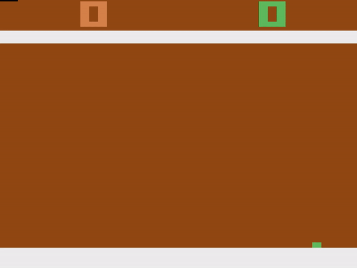
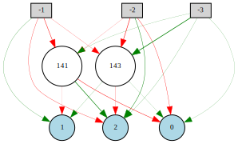
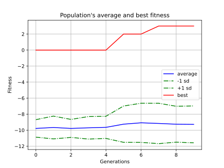
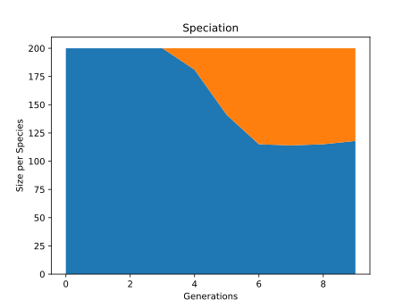

# Solving ATARI Retro Pong with NEAT RL Algorithm

Using Neuroevolution of Augmented Topologies (NEAT) in Python in order to solve ATARI Pong simulation provided by OpenAI Gym library. More interesting parts of this project in my opinion were the image pre-processing, multiple worker-AIs learning on multiple threads setup and setting up the reinforced-learning loop for the AI.

<p align="center">    
    
</p>

# To run
1. Create new venv via your favorite python tool (mine is `python3 -m venv venv`)
2. Run
```
pip install -r requirements.txt
```
3. Run app via the basic CLI

# CLI
Very basic and crude, but somewhat working. Example usages:

`python3 main.py pong train new`

`python3 main.py train checkpoints/checkpoint-1.foo`

`python3 main.py pong test`

# Training results

The result of training process is `winner_1694178090.807158`.

The structure of this agent:

<p align="center">    
    
</p>

```
Nodes:
	0 DefaultNodeGene(key=0, bias=3.757662627245978, response=1.0, activation=relu, aggregation=sum)
	1 DefaultNodeGene(key=1, bias=3.968907370071902, response=1.0, activation=relu, aggregation=sum)
	2 DefaultNodeGene(key=2, bias=1.7548629484504967, response=1.0, activation=relu, aggregation=sum)
Connections:
    DefaultConnectionGene(key=(-3, 1), weight=0.810558177743558, enabled=True)
	DefaultConnectionGene(key=(-3, 2), weight=1.049650346889527, enabled=True)
	DefaultConnectionGene(key=(-2, 0), weight=2.5728533470496604, enabled=False)
	DefaultConnectionGene(key=(-1, 0), weight=-2.0634971801223627, enabled=True)
```

Avg fitness progression through generations (max achievable score was 4 because of timesteps set to 800.
More timesteps == more time to play game == more points during training):

<p align="center">    
    
</p>

Species in population through generations:
<p align="center">    
    
</p>

# Random notes
- On Linux I also needed `sudo apt install swig`, and I did `pip install box2d-py` manually as well.
