# Solving ATARI Retro Pong with NEAT RL Algorithm

Using Neuroevolution of Augmented Topologies (NEAT) in Python in order to solve ATARI Pong simulation provided by OpenAI Gym library. More interesting parts of this project in my opinion were the image pre-processing, multiple worker-AIs learning on multiple threads setup and setting up the reinforced-learning loop for the AI.

# To run
1. Create new venv via your favorite python tool (mine is `python3 -m venv venv`)
2. Run
```
pip install -r requirements.txt
```
3. Run app via the basic CLI

# CLI
Very basic and crude, but somewhat working. Example usages:

`python3 main.py pong train new deterministic`

`python3 main.py train checkpoints/checkpoint-1.foo deterministic`

`python3 main.py pong test stochastic`

# Training results

The result of training process are two agents: `winner_deterministic.pkl` and `winner_stochastic.pkl`. 

## Deterministic Agent

<p align="center">    
    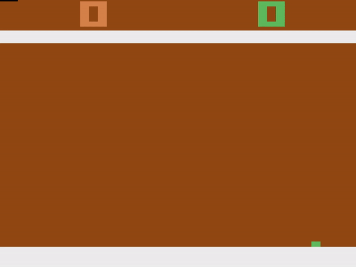
</p>

Since ATARI's Pong is purely deterministic (ATARI-AI's moves are possible to be predicted and are dependant on player's moves - that results in `winner_deterministic.pkl` agent. This means that if player plays in a certain way, he can be sure that ATARI-AI will respond in a way he expects it to). Agent learned to exploit this fact, learned a set of optimal moves and completely outplayed and soft-locked opponent with it, which always leads to a win.

<b>This agent wins 2:0 against ATARI-AI every time.</b>

The structure of deterministic agent:

<p align="center">    
    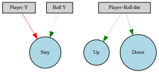
</p>

```
Nodes:
	0 DefaultNodeGene(key=0, bias=3.757662627245978, response=1.0, activation=relu, aggregation=sum)
	1 DefaultNodeGene(key=1, bias=3.968907370071902, response=1.0, activation=relu, aggregation=sum)
	2 DefaultNodeGene(key=2, bias=1.7548629484504967, response=1.0, activation=relu, aggregation=sum)
Connections:
    DefaultConnectionGene(key=(-3, 1), weight=0.810558177743558, enabled=True)
	DefaultConnectionGene(key=(-3, 2), weight=1.049650346889527, enabled=True)
	DefaultConnectionGene(key=(-2, 0), weight=2.5728533470496604, enabled=False)
	DefaultConnectionGene(key=(-1, 0), weight=-2.0634971801223627, enabled=True)
```

It is interesting to see such a minimal topology here, and that despite the fact that all inputs were connected to all outputs at the start, NEAT decided to remove part of the connections (for example, `up` and `down` actions are decided purely on player-ball distance value, ommiting ball and player positions). 

Avg fitness progression through generations (max achievable score was 4 because of timesteps set to 800. More timesteps means more time to play game, more time means more points scored during training):

<p align="center">    
    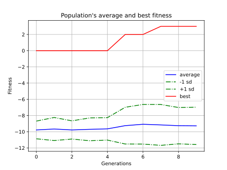
</p>

Species in population through generations:
<p align="center">    
    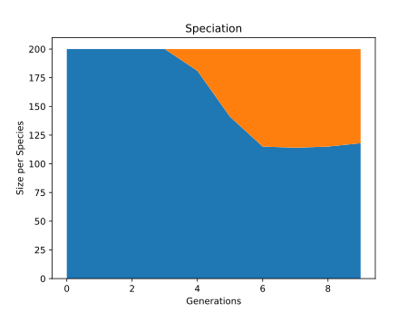
</p>

## Stochastic Agent 

<p align="center">    
	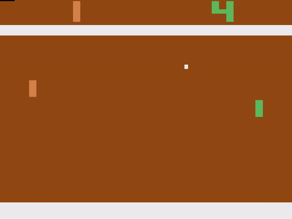
</p>

OpenAI Gym provides two ways to battle the deterministic nature of ATARI environments: frameskips and sticky actions. Frameskips mean that agent gets only a part of observations returned from the environment, sticky action means that there's a chance of repeating last action instead of taking a new one.
Currently agent skips one or two frames per every one they see (set in code as `frameskip=(1,2)`, taken randomly) and there's 5% chance of sticky action happening (`repeat_action_probability=0.05`).

<b>This agent does not play perfectly, perhaps with more training it would be able to score perfect victories, but it is still able to win against ATARI-AI reliably with a big advantage - example scores are 21:5, 21:4 21:3 in favor of the agent.</b>

The structure of stochastic agent:

<p align="center">    
    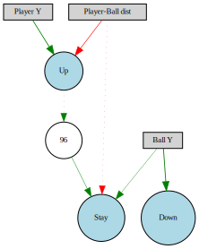
</p>

```
Nodes:
	0 DefaultNodeGene(key=0, bias=1.6548583087324051, response=1.0, activation=relu, aggregation=sum)
	1 DefaultNodeGene(key=1, bias=0.44118763111874104, response=1.0, activation=relu, aggregation=sum)
	2 DefaultNodeGene(key=2, bias=-1.9931345655927666, response=1.0, activation=relu, aggregation=sum)
	96 DefaultNodeGene(key=96, bias=3.6584799623322946, response=1.0, activation=relu, aggregation=sum)
Connections:
	DefaultConnectionGene(key=(-3, 0), weight=-0.627809241064674, enabled=False)
	DefaultConnectionGene(key=(-3, 1), weight=-2.5253657809835257, enabled=True)
	DefaultConnectionGene(key=(-2, 0), weight=1.145444006171087, enabled=True)
	DefaultConnectionGene(key=(-2, 2), weight=3.918343634846612, enabled=True)
	DefaultConnectionGene(key=(-1, 1), weight=3.6200207074441964, enabled=True)
	DefaultConnectionGene(key=(1, 96), weight=0.43039566002480434, enabled=False)
	DefaultConnectionGene(key=(96, 0), weight=1.6968276843853822, enabled=True)
```

The structure is noticably more complex than the deterministic one, and it is also interesting to see that the agent learned to use the `up` and `down` actions, which were not used in the deterministic agent. This is because the stochastic agent is not able to (perfectly) predict ATARI-AI's moves, so it has to react to them.

It's worth noting that some of the connections are disabled (as can be seen in the code snippets"), which means that some branches of nets are disabled, but are considered valuable enough by NEAT to not get rid of.

Avg fitness progression through generations (this time timesteps param was set to 1600):

<p align="center">    
    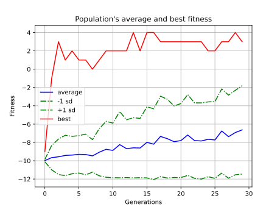
</p>

Species in population through generations. It's interesting to see the original species go extinct around generation 25:
<p align="center">    
    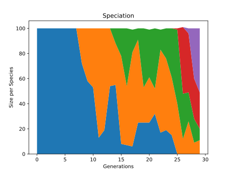
</p>

## Stochastic Agent +30 more generations

<p align="center">    
	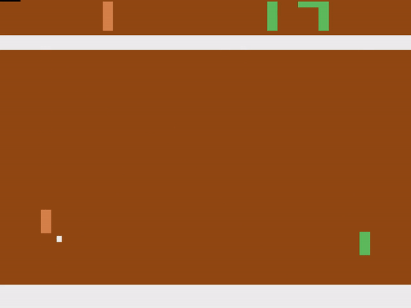
</p>

<b>After training stochastic agent described above for 30 more generations, it was able to achieve perfect score against ATARI-AI (21:0) or come close to it (e.g. 21:1)</b>. It mostly exploited the opponent with optimal moves, but when things went out of control it adapted very well and carried out other tactics. It's likely that with even more generations it would get perfect score every time.

The structure of the agent:

<p align="center">    
	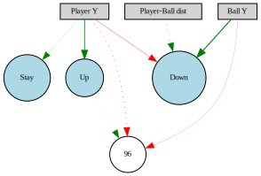
</p>

```
Nodes:
	0 DefaultNodeGene(key=0, bias=2.883798586231094, response=1.0, activation=relu, aggregation=sum)
	1 DefaultNodeGene(key=1, bias=2.8721428075269113, response=1.0, activation=relu, aggregation=sum)
	2 DefaultNodeGene(key=2, bias=6.36800286531754, response=1.0, activation=relu, aggregation=sum)
	96 DefaultNodeGene(key=96, bias=2.4240037375307417, response=1.0, activation=relu, aggregation=sum)
Connections:
	DefaultConnectionGene(key=(-3, 2), weight=1.2178290797614308, enabled=False)
	DefaultConnectionGene(key=(-2, 2), weight=5.039511630294113, enabled=True)
	DefaultConnectionGene(key=(-2, 96), weight=-0.26560251446546485, enabled=True)
	DefaultConnectionGene(key=(-1, 0), weight=0.012287893285269143, enabled=True)
	DefaultConnectionGene(key=(-1, 1), weight=3.601375265699315, enabled=True)
	DefaultConnectionGene(key=(-1, 2), weight=-1.0043851244458164, enabled=True)
	DefaultConnectionGene(key=(-1, 96), weight=-1.9378402825572794, enabled=False)
	DefaultConnectionGene(key=(1, 96), weight=0.10400295687526263, enabled=False)
```

The structure is pretty confusing, especially the singular node `96`. There's quite some disabled connections though, and the node `96` is not linked to any of the output nodes (but it might, via a mutation in future).

Avg fitness progression through generations 30-60:

<p align="center">    
    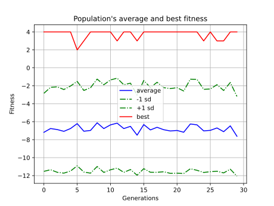
</p>

Species in population through generations 30-60: 

<p align="center">    
    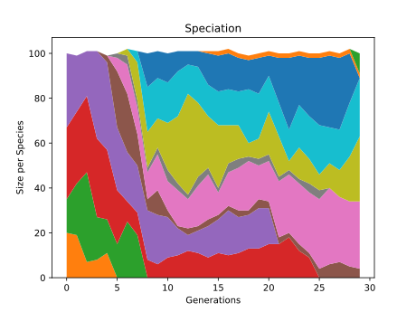
</p>

# Random notes
- On Linux I also needed `sudo apt install swig`, and I did `pip install box2d-py` manually as well.
